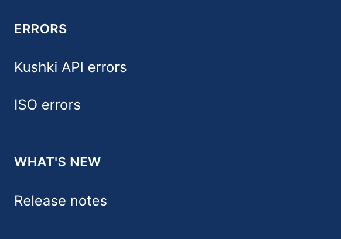
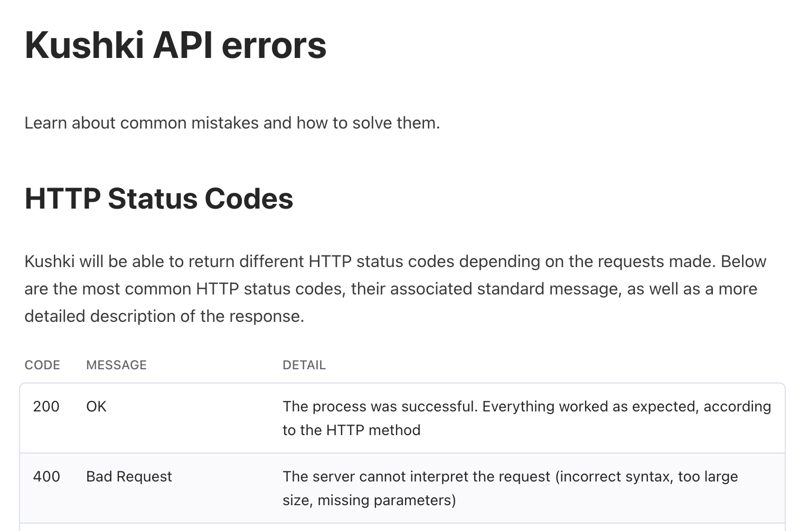
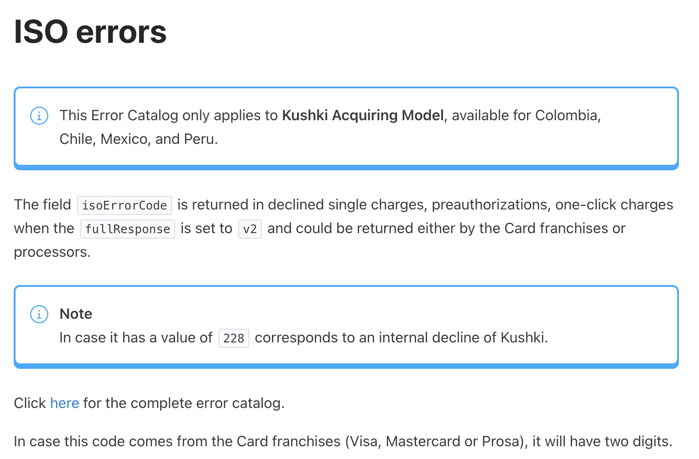
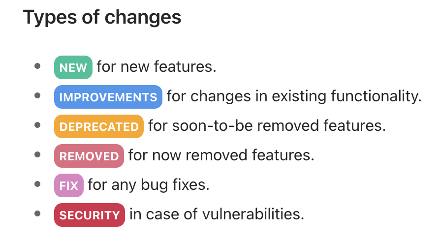
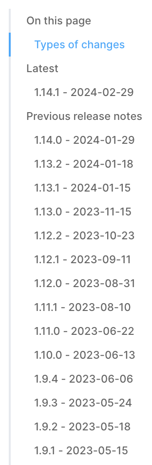
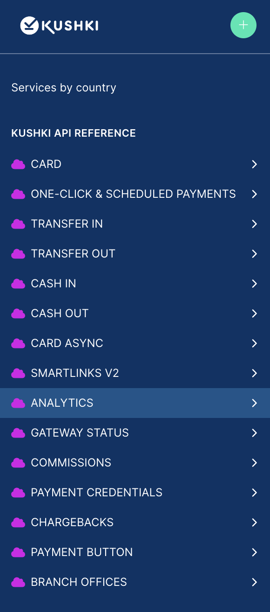
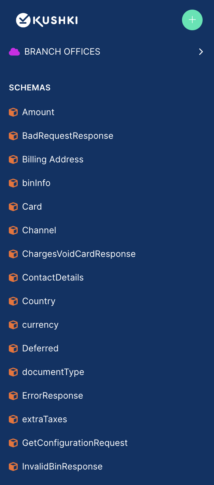
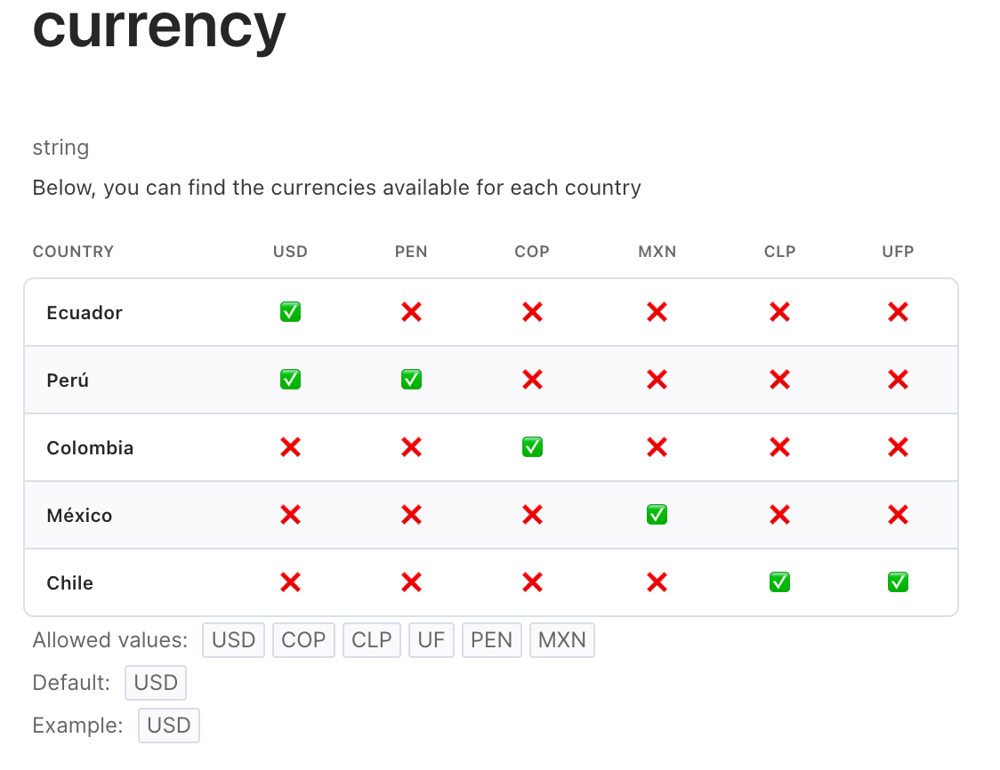

<div style="background:#1E65AE;">

<br>
<h1 style="color:white;font-weight:bold;font-size: 60px;margin-left:100px;margin-top:50px;margin-right:100px;margin-bottom:50px;">Release notes</h1>

<p style="color:white;margin-left:100px;margin-bottom:50px;margin-right:100px;font-size:1.3em;">Discover the latest feature releases, product improvements and bug fixes of <b>Kushki online payment services</b>.</p>
<br>
</div>

<br>

**Stay up to date with changes and updates to the Kushki API.**

We used the [ISO 8601](https://www.iso.org/iso-8601-date-and-time-format.html) standard (**YYYY-MM-DD**) for dates, the Semantic Versioning (**MAJOR.MINOR.PATCH**) for version numbers, increasing the:

1. **MAJOR** version when we make incompatible API changes,
2. **MINOR** version when we add functionality in a backward-compatible manner, and
3. **PATCH** version when we make backward-compatible bug fixes

### Types of changes

- <b style="background-color:#0DC298;color:white;border-radius: 8px;padding: 5px;width: 20%;text-align: center;font-size: 12px;">NEW</b> for new features.
- <b style="background-color:#4498EE;color:white;border-radius: 8px;padding: 5px;width: 20%;text-align: center;font-size: 12px;">IMPROVEMENTS</b> for changes in existing functionality.
- <b style="background-color:#ffa500;color:white;border-radius: 8px;padding: 5px;width: 20%;text-align: center;font-size: 12px;">DEPRECATED</b> for soon-to-be removed features.
- <b style="background-color:#E26C81;color:white;border-radius: 8px;padding: 5px;width: 20%;text-align: center;font-size: 12px;">REMOVED</b> for now removed features.
- <b style="background-color:#DD85C3;color:white;border-radius: 8px;padding: 5px;width: 20%;text-align: center;font-size: 12px;">FIX</b> for any bug fixes.
- <b style="background-color:#D62C4B;color:white;border-radius: 8px;padding: 5px;width: 20%;text-align: center;font-size: 12px;">SECURITY</b> in case of vulnerabilities.

<hr>

<!-- 


#### Estilos para los tipos de cambios

NEW: 

<b style="background-color:#0DC298;color:white;border-radius: 8px;padding: 5px;width: 20%;text-align: center;font-size: 12px;">NEW</b>

IMPROVEMENTS:

<b style="background-color:#4498EE;color:white;border-radius: 8px;padding: 5px;width: 20%;text-align: center;font-size: 12px;">IMPROVEMENTS</b>

DEPRECATED:

<b style="background-color:#ffa500;color:white;border-radius: 8px;padding: 5px;width: 20%;text-align: center;font-size: 12px;">DEPRECATED</b>

REMOVED:

<b style="background-color:#E26C81;color:white;border-radius: 8px;padding: 5px;width: 20%;text-align: center;font-size: 12px;">REMOVED</b>

FIX:

<b style="background-color:#DD85C3;color:white;border-radius: 8px;padding: 5px;width: 20%;text-align: center;font-size: 12px;">FIX</b>

SECURITY:

<b style="background-color:#D62C4B;colo🇲🇽r:white;border-radius: 8px;padding: 5px;width: 20%;text-align: center;font-size: 12px;">SECURITY</b>

#### Estilo para el último release note

<h2> <b style="background-color:#023365;color:white;border-radius: 8px;padding: 5px;width: 20%;text-align: center;border-style:solid;border-color:red;">1.14.0</b> 2024-01-29 </h2>

-->

## Latest


<b style="background-color:#0366d6;color:white;border-radius: 10px;padding: 5px 10px;font-size: 12px;">EARLY RELEASE </b>  

<b style="background-color:#023365;color:white;border-radius: 10px;padding: 5px;width: 20%;text-align: center;">1.6.7 - 2025-12-12</b>
<b style="background-color:#4498EE;color:white;border-radius: 8px;padding: 5px 10px;font-size: 12px;">Network Token Transport</b>  

Release including the new Merchant Verification Value (MVV) field support within the networkToken object.

### Updates
#### 🧾  💳 [Card token requests](https://api-docs.kushkipagos.com/docs/online-payments/card/operations/create-a-card-v-1-token) / [Tokenless charge](https://api-docs.kushkipagos.com/docs/online-payments/card/operations/create-a-card-v-2-charge)/[ Pre-authorization without token](https://api-docs.kushkipagos.com/docs/online-payments/card/operations/create-a-card-v-2-pre-authorization) / [Token for subscriptions](https://api-docs.kushkipagos.com/docs/online-payments/one-click-and-scheduled-payments/operations/create-a-subscription-v-1-card-token) enpoints
- A new field has been added inside the networkToken object:
   - **`mvv`** : The 10-digit Merchant Verification Value assigned by Visa.
      - Condition: Optional. Applicable to Visa transactions only.
      - Format: String containing exactly 10 numeric digits.

## Previous release notes

<!--
Previous release notes
-->

<b style="background-color:#0366d6;color:white;border-radius: 10px;padding: 5px 10px;font-size: 12px;">EARLY RELEASE </b>  
### <b style="background-color:#023365;color:white;border-radius: 10px;padding: 5px;width: 20%;text-align: center;">1.16.6 - 2025-11-05</b>
<b style="background-color:#4498EE;color:white;border-radius: 8px;padding: 5px 10px;font-size: 12px;">Network Token Transport</b>  

Early release of documentation for **Chile (CL)** and **Peru (PE)** as part of the **Network Token Transport** project.

### Updates

#### 💳 [Card token requests](https://api-docs.kushkipagos.com/docs/online-payments/card/operations/create-a-card-v-1-token) / [Tokenless charge](https://api-docs.kushkipagos.com/docs/online-payments/card/operations/create-a-card-v-2-charge)/[ Pre-authorization without token](https://api-docs.kushkipagos.com/docs/online-payments/card/operations/create-a-card-v-2-pre-authorization) / [Token for subscriptions](https://api-docs.kushkipagos.com/docs/online-payments/one-click-and-scheduled-payments/operations/create-a-subscription-v-1-card-token)
A new field has been added:

**`originalTransactionID`**  : The unique identifier of the original transaction, used exclusively in external subscription flows where Kushki processes on-demand charges and tokenization is handled externally.

- **Condition:** Must be sent if the `externalSubscriptionID` field is present.  
- **Note:** For Visa transactions, only **15 numeric digits** are accepted.

---

#### 💳 [Card token requests](https://api-docs.kushkipagos.com/docs/online-payments/card/operations/create-a-card-v-1-token) / [Tokenless charge](https://api-docs.kushkipagos.com/docs/online-payments/card/operations/create-a-card-v-2-charge)/[ Pre-authorization without token](https://api-docs.kushkipagos.com/docs/online-payments/card/operations/create-a-card-v-2-pre-authorization) / [Token for subscriptions](https://api-docs.kushkipagos.com/docs/online-payments/one-click-and-scheduled-payments/operations/create-a-subscription-v-1-card-token)
The following fields have been added:

- **`card.cryptogram`** — Cryptographic value associated with network tokens.  
- **`isNetworkToken`** *(boolean)* — Indicates whether the card number provided is a network token.  
- **`networkToken`** *(object)* — Contains additional information required for network token transactions (e.g., `deviceType`, `requestorId`, `source`, `walletId`, `authenticationLevel`).

---

This update enables early integration and testing of network token support in CL and PE environments.

### <b style="background-color:#023365;color:white;border-radius: 10px;padding: 5px;width: 20%;text-align: center;">1.16.5 - 2025-10-27</b>
<b style="background-color:#4498EE;color:white;border-radius: 8px;padding: 5px;width: 20%;text-align: center;font-size: 12px;">IMPROVEMENTS</b>

### 🚀 New Installment Type Available in Chile: "Cuotas Comercio" 🇨🇱
<b style="background-color:#0366d6; color:white; border-radius: 6px; padding: 3px 8px; font-size: 12px; font-weight: 600;"> PRODUCT IN BETA VERSION</b>

We have expanded our deferred payment options in Chile (CL) to include the "Cuotas Comercio" modality.

This merchant-funded installment type has the following characteristics:

- Installment Range: Must be sent between 2 and 12 installments.

- Minimum Amount: The minimum amount does apply (following standard regulations).

- Transaction Identification: To distinguish a transaction as "Cuotas Comercio", you must send the field `creditType` with the value `03` within the `deferred` object.

You can include this deferred type within the following requests:
- [Make a charge or deferred charge ](https://api-docs.kushkipagos.com/docs/online-payments/card/operations/create-a-card-v-1-charge) 
- [Charge (without token) ](https://api-docs.kushkipagos.com/docs/online-payments/card/operations/create-a-card-v-2-charge) 
- [Pre-authorization](https://api-docs.kushkipagos.com/docs/online-payments/card/operations/create-a-card-v-1-pre-authorization)  
- [Pre-authorization (without token) ](https://api-docs.kushkipagos.com/docs/online-payments/card/operations/create-a-card-v-2-pre-authorization) 

**Subscriptions**
- [Make a One-click payment](https://api-docs.kushkipagos.com/docs/online-payments/one-click-and-scheduled-payments/operations/create-a-subscription-v-1-card-1) (for existing subscriptions)

---

#### New Response Fields for Merchant Installments (Cuotas Comercio)

The following fields were added to the **[Get Transactions List V2](https://api-docs.kushkipagos.com/docs/online-payments/analytics/operations/get-a-analytics-v-2-transactions-list)** service response to support Chilean merchant installments (Cuotas Comercio):

| Field | Type | Description |
|-------|------|-------------|
| `transaction_sub_type` | `string` | Subtype for merchant installment transactions. Possible values: `installment` → current installment being charged, `principal` → total financed amount. Applies only to Chile. |
| `principal_amount` | `number` | Total financed amount under a merchant installment plan. Applies only to Chile in transactions of type `installment`. |
| `installment_count` | `string` | Sequence number of the installment being collected. To see the total number of installments, refer to `number_of_months`. Applies only to Chile. |
| `principal_ticket_code` | `string` | Ticket number of the `principal` transaction associated with a merchant installment. Used to link each installment charge back to the original financed transaction. Applies only to Chile. |

---

<b style="background-color:#DD85C3;color:white;border-radius: 8px;padding: 5px;width: 20%;text-align: center;font-size: 12px;">FIX</b>

- Corrected minor errors in the API specification.
- Improved consistency across card-present and deferred payment flows.


### <b style="background-color:#023365;color:white;border-radius: 10px;padding: 5px;width: 20%;text-align: center;">1.16.2 - 2025-09-23</b>

<b style="background-color:#0DC298;color:white;border-radius: 8px;padding: 5px;width: 20%;text-align: center;font-size: 12px;">NEW</b>
#### Card Payouts now available in Chile 🇨🇱!

This release introduces the new **Card Payouts** product, now available for **Chile** 🇨🇱.

Card Payouts in Chile allows you to send funds directly to **Visa** debit or credit cards, providing a fast and reliable payout solution. This service is ideal for disbursements such as refunds, commissions, or reimbursements, and integrates seamlessly into your existing flow via API or hosted fields.

The launch includes a complete set of endpoints to support secure tokenization, fund transfers, subscription management, and transaction status tracking.

Check the full documentation and examples in the [Card Payouts section](https://api-docs.kushkipagos.com/docs/online-payments/card-outs).

### <b style="background-color:#023365;color:white;border-radius: 10px;padding: 5px;width: 20%;text-align: center;">1.16.1 - 2025-09-01</b>

<b style="background-color:#0DC298;color:white;border-radius: 8px;padding: 5px;width: 20%;text-align: center;font-size: 12px;">NEW</b>

### Idempotency now available in Online Payments 

We’ve added support for the `Idempotency-Key` header to help you safely retry requests without the risk of processing the same transaction twice. This is especially useful in cases of timeouts, network issues, or client retries.

#### Where it works
- **Void a transaction** (one-time charges, preauthorizations, and subscription charges)  
- **Refund a transaction** (one-time charges, preauthorizations, and subscription charges)  
- **Subscription preauthorizations**  

Click [here](https://api-docs.kushkipagos.com/docs/online-payments/card#idempotency) for more information.

### <b style="background-color:#023365;color:white;border-radius: 10px;padding: 5px;width: 20%;text-align: center;">1.16.0 - 2025-07-03</b>

<b style="background-color:#0DC298;color:white;border-radius: 8px;padding: 5px;width: 20%;text-align: center;font-size: 12px;">NEW</b>
#### Card Payouts now available in Peru!

This release introduces the new **Card Payouts** product, now available exclusively for **Peru** 🇵🇪.

Card Payouts allows you to send funds directly to **Visa** and **Mastercard** debit or credit cards, providing a fast and reliable payout solution. This service is ideal for disbursements such as refunds, commissions, or reimbursements, and integrates seamlessly into your existing flow via API or hosted fields.

The launch includes a complete set of endpoints to support secure tokenization, fund transfers, subscription management, and transaction status tracking.

Check the full documentation and examples in the [Card Payouts section](https://api-docs.kushkipagos.com/docs/online-payments/card-outs).


### <b style="background-color:#023365;color:white;border-radius: 10px;padding: 5px;width: 20%;text-align: center;">1.15.8 - 2025-06-18</b>

<b style="background-color:#4498EE;color:white;border-radius: 8px;padding: 5px;width: 20%;text-align: center;font-size: 12px;">IMPROVEMENTS</b>

####  New field added to the `get status` response for transfer in

Starting now, the `paymentCode` field will be returned in the `metadata` object of the [get status](https://api-docs.kushkipagos.com/docs/online-payments/branches/1.15.8/transfer-in/operations/get-a-transfer-v-1-status) response for **Transfer In** transactions in **Peru** 🇵🇪.


### <b style="background-color:#023365;color:white;border-radius: 10px;padding: 5px;width: 20%;text-align: center;">1.15.7 - 2025-05-19</b>

<b style="background-color:#4498EE;color:white;border-radius: 8px;padding: 5px;width: 20%;text-align: center;font-size: 12px;">IMPROVEMENTS</b>

#### Support for external subscriptions in Ecuador

- The `externalSubscriptionId` field is now available in Ecuador for the aggregator model. When this field is included, transactions are marked as third-party initiated recurring payments. Click [here](https://docs.kushki.com/ec/recurring-payments/external-subscriptions) for more information.

#### Changes to the get transaction list V2 endpoint

- Removed filters: `bin_card`,`last_four_digits`.
- Added a new response field `external_reference_id`. Available only for card transactions. This is a unique transaction ID generated by the merchant. Click here for [further](https://api-docs.kushkipagos.com/docs/online-payments/branches/1.15.7/analytics/operations/get-a-analytics-v-2-transactions-list) information.


### <b style="background-color:#023365;color:white;border-radius: 10px;padding: 5px;width: 20%;text-align: center;">1.15.6 - 2025-04-16</b>

<b style="background-color:#4498EE;color:white;border-radius: 8px;padding: 5px;width: 20%;text-align: center;font-size: 12px;">IMPROVEMENTS</b>

### New 3DS 100% API Authentication Option

A new value `iframe` is now supported for the `authValidation` parameter in the token request of the 3DS 100% API authentication flow.

With `iframe`, merchants can embed the authentication experience directly into their website or app, avoiding redirections. It is the merchant's responsibility to listen for iframe events to determine the result of the authentication and trigger the appropriate actions.

📚 See the updated [API reference](https://api-docs.kushkipagos.com/docs/online-payments/card/operations/create-a-card-v-1-token) and [3DS 100% API Integration Guide](https://docs.kushkipagos.com/mx/es/one-time-payments/card/on-demand#autenticaci%C3%B3n-3ds-v%C3%ADa-api) for more details.


<b style="background-color:#E26C81;color:white;border-radius: 8px;padding: 5px;width: 20%;text-align: center;font-size: 12px;">REMOVED</b>

- The **Branch Offices API** (`/branch`) has been removed from the documentation.
- The **Chargebacks API** (`/chargebacks`) has also been removed from the public API documentation.

### <b style="background-color:#023365;color:white;border-radius: 10px;padding: 5px;width: 20%;text-align: center;">1.15.5 - 2025-03-19</b>

<b style="background-color:#0DC298;color:white;border-radius: 8px;padding: 5px;width: 20%;text-align: center;font-size: 12px;">NEW</b>

### Get Commission Configuration Now Available in Mexico 🇲🇽

We are excited to announce that the **[Get Commission Configuration](https://api-docs.kushkipagos.com/docs/online-payments/commissions%2Foperations%2Fcreate-a-commission-v-1-configuration)** service is now available for **Mexico**.

With this update, merchants operating in Mexico can now leverage the **Third-Party Commissions** modality, which enables **split payments**. This feature allows the division and dispersal of a card transaction into two different accounts with a single charge, using:

- A predefined percentage
- A fixed amount
- A combination of both

For more details on how to implement split payments in Mexico, please refer to our [Split Payments Guide](https://docs.kushki.com/mx/en/card-payments/split-payments).

### <b style="background-color:#023365;color:white;border-radius: 10px;padding: 5px;width: 20%;text-align: center;">1.15.4 - 2025-02-05</b>

<b style="background-color:#0DC298;color:white;border-radius: 8px;padding: 5px;width: 20%;text-align: center;font-size: 12px;">NEW</b>

### **New Release: Get Transactions List v2** 🚀

We are excited to announce the release of **Get Transactions List v2**, an upgraded version of our transaction retrieval endpoint. This new version enhances flexibility and efficiency when accessing transaction data.  

#### **What's New?**  
✅ **Expanded Coverage** – Supports both card-present and card-not-present transactions.  
✅ **Enhanced Filtering** – Allows filtering by pay-ins and pay-outs for more granular insights.  
✅ **Optimized Pagination** – Returns transactions in descending order, displaying the most recent ones first.   

With these enhancements, **Get Transactions List v2** provides a more comprehensive and streamlined way to retrieve transaction records for a specific merchant.  

🔗 [API Documentation](https://api-docs.kushkipagos.com/docs/online-payments/analytics/operations/get-a-analytics-v-2-transactions-list)  

### <b style="background-color:#023365;color:white;border-radius: 10px;padding: 5px;width: 20%;text-align: center;">1.15.3 - 2025-02-07</b>

<b style="background-color:#4498EE;color:white;border-radius: 8px;padding: 5px;width: 20%;text-align: center;font-size: 12px;">IMPROVEMENTS</b>

#### External reference ID now supported in card payments and voids
- Now you can send an `externalReferenceId` in the services: [Make a charge or deferred charge](https://api-docs.kushkipagos.com/docs/online-payments/card/operations/create-a-card-v-1-charge), [Create payment (tokenless)](https://api-docs.kushkipagos.com/docs/online-payments/card/operations/create-a-card-v-2-charge), [Void a transaction](https://api-docs.kushkipagos.com/docs/online-payments/card/operations/delete-a-v-1-charge), [Refund a transaction](https://api-docs.kushkipagos.com/docs/online-payments/card/operations/delete-a-v-1-refund), [Authorize payments](https://api-docs.kushkipagos.com/docs/online-payments/card/operations/create-a-card-v-1-pre-authorization), [Preauthorization (tokenless)](https://api-docs.kushkipagos.com/docs/online-payments/card/operations/create-a-card-v-2-pre-authorization),and [Capture an authorized payment](https://api-docs.kushkipagos.com/docs/online-payments/card/operations/create-a-card-v-1-capture). This will be also returned in the responses of those endpoints, even if the transaction is declined.
- The `externalReferenceId` has been include in the response of the [get transaction list](https://api-docs.kushkipagos.com/docs/online-payments/analytics/operations/get-a-analytics-v-1-transactions-list) service v1.
#### Metadata object now supported in voids and refunds.
- Users can now send the object `metadata` while trying to perform a [refund](https://api-docs.kushkipagos.com/docs/online-payments/card/operations/delete-a-v-1-refund) or [void](https://api-docs.kushkipagos.com/docs/online-payments/card/operations/delete-a-v-1-charge) via API


### <b style="background-color:#023365;color:white;border-radius: 10px;padding: 5px;width: 20%;text-align: center;">1.15.2 - 2024-11-14</b>

- Updated transaction status for [voids](../../reference/CARD.yaml/paths/~1v1~1charges~1{ticketNumber}/delete) and [refunds](../../reference/CARD.yaml/paths/~1v1~1refund~1{ticketNumber}/delete).

<hr>

### <b style="background-color:#023365;color:white;border-radius: 10px;padding: 5px;width: 20%;text-align: center;">1.15.1 - 2024-08-28</b>

<b style="background-color:#4498EE;color:white;border-radius: 8px;padding: 5px;width: 20%;text-align: center;font-size: 12px;">IMPROVEMENTS</b>

#### Transfiya now available in Colombia for transfer out (Beta phase)

- Now you can make dispersions in Colombia using the cell phone number through Transfiya. For this purpose the `accountType`= `NC` has been added in the [Transfer out token request](https://api-docs.kushkipagos.com/docs/online-payments/branches/PREAD-141-TRANSFIYA/transfer-out/operations/create-a-payout-transfer-v-1-token).
* Updated max length descriptions for transfer out PE token

### <b style="background-color:#023365;color:white;border-radius: 10px;padding: 5px;width: 20%;text-align: center;">1.15.0 - 2024-05-02</b>

<b style="background-color:#0DC298;color:white;border-radius: 8px;padding: 5px;width: 20%;text-align: center;font-size: 12px;">NEW</b>

#### Tokenless operations

Now you can make a charge or pre-authorization without the need to request a token (tokenless).

This operations are only available for Acquirer model in Chile 🇨🇱, Colombia 🇨🇴, México 🇲🇽, and Perú 🇵🇪.

Get more information on the [Create payment (tokenless)](../../reference/CARD.yaml/paths/~1card~1v2~1charges/post) or [Preauthorization (tokenless)](../../reference/CARD.yaml/paths/~1card~1v2~1preAuthorization/post) endpoint.
##### CIT,MIT and MAC codes for Kushki Acquirer
- Kushki now accepts the CIT or MIT code for Visa or Mastercard on transactions that allow processing with external subscription engine ([single charge](https://api-docs.kushkipagos.com/docs/online-payments/card/operations/create-a-card-v-1-charge), [tokenless charge](https://api-docs.kushkipagos.com/docs/online-payments/card/operations/create-a-card-v-2-charge),[ preauthorization](https://api-docs.kushkipagos.com/docs/online-payments/card/operations/create-a-card-v-1-pre-authorization), and [tokenless preauthorization](https://api-docs.kushkipagos.com/docs/online-payments/card/operations/create-a-card-v-2-pre-authorization)). This optional field is called `citMit`.
- New brand rejection responses were added, including MAC code for Mastercard. This is located in parameter `s84`, within the `messageFields` object of the single charge or pre-authorization responses.
##### New parameter added Transaction ARN
- The Acquirer Reference Number(ARN) `transaction_arn` has been added to the response in the get transaction list service.  Only applies to the Kushki Acquirer model and it may take 1 business day to be reflected.

### <b style="background-color:#023365;color:white;border-radius: 10px;padding: 5px;width: 20%;text-align: center;">1.14.2 - 2024-03-05</b>

<b style="background-color:#4498EE;color:white;border-radius: 8px;padding: 5px;width: 20%;text-align: center;font-size: 12px;">IMPROVEMENTS</b>

#### Updated max length descriptions for transfer out PE token

- Updated the description for the fields `documentNumber` and `accountNumber` in the [transfer out token request](https://api-docs.kushkipagos.com/docs/online-payments/transfer-out/operations/create-a-payout-transfer-v-1-token) for Perú 🇵🇪 as follows:

`documentNumber`:
- For Mexico, enter `ND` or in case you don't know it. <br>
- For `RUT` in **Chile** if the check digit is a **K** letter, send it in **upper case**.<br>
- For `DNI` in Peru, it must be 8 characters in length<br>
- For `RUC` in Peru, it must be 11 characters in length<br>
- For `CE` in Peru, the max. length is `12` characters.<br>
- For `PAS` in Peru, the max. length is `12` characters.<br>
`accountNumber`:
- For Peru, if the `BankId` is `002` and the accountType is `CC`, it must be **13 digits** in length.<br>
- For Peru, if the `BankId` is `002` and the accountType is `CA`,  it must be **14 digits** in length.<br>
- For Peru, if the `BankId` is different than `002`, it must be **20 digits** in length.

### <b style="background-color:#023365;color:white;border-radius: 10px;padding: 5px;width: 20%;text-align: center;">1.14.1 - 2024-02-29</b>

<b style="background-color:#0DC298;color:white;border-radius: 8px;padding: 5px;width: 20%;text-align: center;font-size: 12px;">NEW</b>

#### New `ERRORS` category

Error catalogs are now grouped under the category `ERRORS`. **Error catalog** is now **Kushki API errors** and **ISO error catalog** is now **ISO errors**.

<!-- focus: top
bg: white
 -->



<br>




<br>




#### Presenting the new format for changes in documentation

The format has been updated for changes made to the documentation. Find the changes much easier with the types of changes separated by categories and with a different color for each one.

Now, all changes are concentrated in the release-notes file instead of having a separate file per version. You will be able to access all the changes from a single place.

The following types of changes were modified:

* `Added` -> <b style="background-color:#0DC298;color:white;border-radius: 8px;padding: 5px;width: 20%;text-align: center;font-size: 12px;">NEW</b>
* `Changed` -> <b style="background-color:#4498EE;color:white;border-radius: 8px;padding: 5px;width: 20%;text-align: center;font-size: 12px;">IMPROVEMENTS</b>
* `Fixed` -> <b style="background-color:#DD85C3;color:white;border-radius: 8px;padding: 5px;width: 20%;text-align: center;font-size: 12px;">FIX</b>




Check the changes of each version with the new content menu.



<b style="background-color:#4498EE;color:white;border-radius: 8px;padding: 5px;width: 20%;text-align: center;font-size: 12px;">IMPROVEMENTS</b>

#### Updated specificationVersion for external 3D Secure authentication engines

Updated the note in the `threeDomainSecure` schema description about 3D Secure version 1 support.

Old version.

<!-- theme: warning -->
> #### Important notice about support for version 1 of 3D Secure!
>**NOTE**: 3DS version 1 will no longer be supported after October 2022. Merchants will need to migrate to version 2 of the protocol to avoid any impact on their transactions.

New version.

<!-- theme: warning -->
> #### Important notice about support for version 1 of 3D Secure!
>**NOTE**: Support for 3D Secure 1.0.2 and related technology ended in October 2022. Merchants will need to migrate to version 2 of the protocol to avoid any impact on their transactions.

We also update the allowed values for the `specificationVersion` field in the same model. Now, the allowed values are `2.0.0` and `2.2.0`.

Old version.

```json json_schema
{
  "title": "threeDomainSecure",
  "type": "object",
  "properties": {
    "specificationVersion": {
      "description": "3DS protocol version to implement\n\n**NOTE: 3DS version 1 will no longer be supported after October 2022. Merchants will need to migrate to version 2 of the protocol to avoid any impact on their transactions.**",
      "type": "string",
      "enum": [
                "1.0.2",
                "2.0.0"
            ],
            "minLength": 5,
            "maxLength": 5,
            "pattern": "[1-2].[0-9].[0-9]"
    }
  },
  "required": [ "specificationVersion"]
}
```

New Version.

```json json_schema
{
  "title": "threeDomainSecure",
  "type": "object",
  "properties": {
    "specificationVersion": {
      "description": "3DS protocol version to implement\n\n**NOTE: Support for 3D Secure 1.0.2 and related technology ended in October 2022. Merchants will need to migrate to version 2 of the protocol to avoid any impact on their transactions.**",
      "type": "string",
      "enum": [
                "2.0.0",
                "2.2.0"
            ],
            "minLength": 5,
            "maxLength": 5,
            "pattern": "[1-2].[0-9].[0-9]"
    }
  },
  "required": [ "specificationVersion"]
}
```

Version `1.0.2` of `specificationVersion` has been deprecated and replaced by version `2.2.0`. All references to the previous version in the documentation have been updated.

#### The side menu has been restructured by categories for better navigation

Improved navigation experience in the side menu which is now divided by categories.



<br>



<br>


<hr>

### <b style="background-color:#023365;color:white;border-radius: 10px;padding: 5px;width: 20%;text-align: center;">1.14.0 - 2024-01-29</b>

<b style="background-color:#0DC298;color:white;border-radius: 8px;padding: 5px;width: 20%;text-align: center;font-size: 12px;">NEW</b>

* Added support for 3D Secure authentication in API integrations.

* Added `binCard` property to binInfo schema.

* CARD - Request a card token:

    * Added **3D Secure (3DS) authentication** section in the endpoint description.
    * Added `url` field in response type 200 for a required 3D Secure authentication.
    * Added `authValidation` and `callbackUrl` fields in the request for 3D Secure authentication.

* CARD - Make a charge or deferred charge:

    * Added example `GL -  K322 - Autenticación fallida - Sin validación de seguridad` of type 400 in the response for a failed 3D Secure authentication
    * Added `amount`, `binInfo`, `created`, `merchantId`, `requestAmount`, `transactionStatus`, `transactionType` properties in 400 type responses.
    
    * Added error parameter `isoErrorCode`  within `details` object for declined transactions in Kushki acquiring model.

* CARD - Authorize payments
    * Added error parameter `isoErrorCode`  within `details` object for declined transactions in Kushki acquiring model.

* CARD ASYNC
   * Added `CARD ASYNC - Authorize payments`, `CARD ASYNC - Capture payments`, `ASYNC CARD RECURRING CHARGES - Authorize payments` and `ASYNC CARD RECURRING CHARGES - Capture an authorized payment` services in the **services by country**  table.

* ONE-CLICK & SCHEDULED PAYMENTS - Make an One-click payment
    * Added error parameter `isoErrorCode`  within `details` object for declined transactions in Kushki acquiring model.

* Kushki Error Catalog
   
   * Added ISO Error Codes article with responses from the card franchises in the `isoErrorCode` field.
 
<b style="background-color:#4498EE;color:white;border-radius: 8px;padding: 5px;width: 20%;text-align: center;font-size: 12px;">IMPROVEMENTS</b>

* Updated the description of the `CARD - Void a transaction` endpoint to add information about partial voids.
* Updated the description of the `CARD - Refund a transaction` endpoint to add information about partial refunds.
* The table of **services by country** was updated with the http method type in the request and links to each service.

###  <b style="background-color:#023365;color:white;border-radius: 10px;padding: 5px;width: 20%;text-align: center;">1.13.2 - 2024-01-18</b>

<b style="background-color:#0DC298;color:white;border-radius: 8px;padding: 5px;width: 20%;text-align: center;font-size: 12px;">NEW</b>

* Added possible values of the `transactionType` field in the response for the endpoints [Authorize payments](https://api-docs.kushkipagos.com/docs/online-payments/one-click-and-scheduled-payments%2Foperations%2Fcreate-a-subscription-v-1-card-authorize) and [Capture an authorized payment](https://api-docs.kushkipagos.com/docs/online-payments/one-click-and-scheduled-payments%2Foperations%2Fcreate-a-subscription-v-1-card-capture).
* Added `validateEmail` field in the endpoint request [SMARTLINKS V2 - Create a Smartlink](https://api-docs.kushkipagos.com/docs/online-payments/smartlinks-v2%2Foperations%2Fcreate-a-smartlink-v-2-smart-link).

<b style="background-color:#4498EE;color:white;border-radius: 8px;padding: 5px;width: 20%;text-align: center;font-size: 12px;">IMPROVEMENTS</b>


* Updated the description of the [ONE-CLICK & SCHEDULED PAYMENTS - Create a recurring charge](https://api-docs.kushkipagos.com/docs/online-payments/one-click-and-scheduled-payments%2Foperations%2Fcreate-a-subscription-v-1-card) endpoint to add detailed information about service execution, retries, and recurrence.

<hr>

###  <b style="background-color:#023365;color:white;border-radius: 10px;padding: 5px;width: 20%;text-align: center;">1.13.1 - 2024-01-15</b>

<b style="background-color:#0DC298;color:white;border-radius: 8px;padding: 5px;width: 20%;text-align: center;font-size: 12px;">NEW</b> 

* **TRANSFER IN -GET Bank List**, example responses were created for Peru.

<b style="background-color:#4498EE;color:white;border-radius: 8px;padding: 5px;width: 20%;text-align: center;font-size: 12px;">IMPROVEMENTS</b>

* **TRANSFER IN -GET Bank List**, example responses were updated for Colombia and Chile. 


<hr>

###  <b style="background-color:#023365;color:white;border-radius: 10px;padding: 5px;width: 20%;text-align: center;">1.13.0 - 2023-11-15</b>


<b style="background-color:#0DC298;color:white;border-radius: 8px;padding: 5px;width: 20%;text-align: center;font-size: 12px;">NEW</b>

* **Transfer out service was added for Peru**, which includes the following transfer out endpoints:
  - Get Bank List
  - Get Bank List V2
  - Request a Transfer Out token
  - Init Transaction
  - Get Status
  - Balance for Payouts
* Error codes for the transfer out service in Peru were added to the error catalog.
* **TRANSFER OUT - Request a Transfer Out token**:
  * Added `mail` field. **Required for Perú.**
  * Updated currencies.

<hr>

###  <b style="background-color:#023365;color:white;border-radius: 10px;padding: 5px;width: 20%;text-align: center;">1.12.2 - 2023-10-23</b>


<b style="background-color:#0DC298;color:white;border-radius: 8px;padding: 5px;width: 20%;text-align: center;font-size: 12px;">NEW</b>

- Added `propina` property to `extraTaxes` object.
- Added error codes `K505`, `K015` and `K555` to the error catalog.
- Added information about initializing a subscription to the `subscriptionDay` field within the request on endpoints **Create a Smartlink** and **Update a Smartlink**.
- **CARD - Request a card token**: 
  - Added `isDeferred` property in the endpoint request.
  - Added information about external subscriptions without sending the cvv in the endpoint description.
  - Added response example for response type 400 "GL - K015 - Transacción no permitida sin ccv2.".
- **CARD - Make a charge or deferred charge**:
  - Information about deferrals in Mexico was added to the description of the endpoint.
  - Added response example for response type 400 "GL - K505 - La transacción fue declinada por el procesador o emisor.".

<hr>

###  <b style="background-color:#023365;color:white;border-radius: 10px;padding: 5px;width: 20%;text-align: center;">1.12.1 - 2023-09-11</b>


<b style="background-color:#0DC298;color:white;border-radius: 8px;padding: 5px;width: 20%;text-align: center;font-size: 12px;">NEW</b>

**CARD - Make a charge or deferred charge:**
  - Added the `externalSubscriptionID` field in the request
  - Added response example for response type 400 `GL - K555 - Solicitud enviada no es válida`

**CARD - Authorize payments:**
  - Added the `externalSubscriptionID` field in the request
  - Added response example for response type 400 `GL - K555 - Solicitud enviada no es válida`

**CARD - Request a card token:**
  - Added request example without cvv `GL - Token without CVV for subscriptions`

<hr>

###  <b style="background-color:#023365;color:white;border-radius: 10px;padding: 5px;width: 20%;text-align: center;">1.12.0 - 2023-08-31</b>


<b style="background-color:#0DC298;color:white;border-radius: 8px;padding: 5px;width: 20%;text-align: center;font-size: 12px;">NEW</b>

- CARD - **Request a card token**:
    - Added information in the description of the request body for merchants in Mexico that have their own recurring transaction engine and/or that wish to validate an account. NOTE: Applies only to México, Colombia, Perú and Chile.
    - Added the `transactionMode` field for recurring charges or account verification in Mexico, Colombia, Perú and Chile.
    - Added the request examples `Initial recurring charge token`, `Subsequent recurring charge` and `Account Verification`.

- Added the **CARD - Reauthorize payments** endpoint for reauthorizations in México, Colombia, Perú and Chile.

- The **CARD - Verify Account** endpoint was added to verify that a credit card is active and has a balance. Applies only to Colombia, México, Perú and Chile.

<b style="background-color:#4498EE;color:white;border-radius: 8px;padding: 5px;width: 20%;text-align: center;font-size: 12px;">IMPROVEMENTS</b>

- CARD - **Authorize payments**:
    - Updated endpoint description indicating the expiration time of an authorization in Mexico, Colombia, Perú and Chile.

- CARD - **Capture an authorized payment**:
    - Updated endpoint description to add support for reauthorizations in México, Colombia, Perú and Chile.

- `Card` Schema:
    - The description for the CVV field was updated indicating that it is optional in Mexico if the merchant has its own recurring charges engine and the `subsequentRecurrence` value is sent in the `transactionMode` field.

- The table Services by country was updated. Added `Reauthorize payments` and `Verify Account` endpoints.

- 3DS was enabled for Chile and Colombia in one-time and recurring payments.

<hr>

###  <b style="background-color:#023365;color:white;border-radius: 10px;padding: 5px;width: 20%;text-align: center;">1.11.1 - 2023-08-10</b>


<b style="background-color:#0DC298;color:white;border-radius: 8px;padding: 5px;width: 20%;text-align: center;font-size: 12px;">NEW</b>

* Added a second version of Transfer Out's Get Bank List endpoint to include more information about banks.

**TRANSFER OUT - Get Bank List V2:**
  - Added the endpoint along with sample responses for Colombia, Chile and Mexico.

<b style="background-color:#4498EE;color:white;border-radius: 8px;padding: 5px;width: 20%;text-align: center;font-size: 12px;">IMPROVEMENTS</b>

* Updated description for `collectionIndicator` field in `threeDomainSecure` object

<hr>

###  <b style="background-color:#023365;color:white;border-radius: 10px;padding: 5px;width: 20%;text-align: center;">1.11.0 - 2023-06-22</b>


<b style="background-color:#0DC298;color:white;border-radius: 8px;padding: 5px;width: 20%;text-align: center;font-size: 12px;">NEW</b>

* Added the functionality of creating smartlinks with an open amount.

**SMARTLINKS - Create Smartlink:**
  - Added `paymentConfigType` field as a new request parameter.
  - Added the `hidePayButtonAmount` and `payButtonText` fields within the `generalConfig ` object in the request.
  - Added new `paymentConfig` object for an open amount. New `taxEnabled`,`currency`, `defaultAmount`, `taxPercentage`, `minAmount`, and `maxAmount` fields added for this object.
  - Added the `language` parameter in the request.

  
**SMARTLINKS - Update Smartlink:**
  - Added `paymentConfigType` field as a new request parameter.
  - Added the `hidePayButtonAmount` and `payButtonText` fields within the `generalConfig ` object in the request.
  - Added new `paymentConfig` object for an open amount. New `taxEnabled`,`currency`, `defaultAmount`, `taxPercentage`, `minAmount`, and `maxAmount` fields added for this object.
  - Added the `language` parameter in the request.

  **SMARTLINKS - Get Smartlink:**
  - Added the `paymentConfigType` field in the response.
  - Added the `hidePayButtonAmount` and `payButtonText` fields within the `generalConfig ` object in the response
  - Added `taxEnabled`,`currency`, `defaultAmount`, `taxPercentage`, `minAmount`, and `maxAmount` fields for the response within the `paymentConfig` object.

<hr>

###  <b style="background-color:#023365;color:white;border-radius: 10px;padding: 5px;width: 20%;text-align: center;">1.10.0 - 2023-06-13</b>

<b style="background-color:#0DC298;color:white;border-radius: 8px;padding: 5px;width: 20%;text-align: center;font-size: 12px;">NEW</b>

- Added new endpoint **CHARGEBACKS - List all chargebacks by status**.
- The error codes CCH001 and CCH010 were added in the error catalog.

<b style="background-color:#ffa500;color:white;border-radius: 8px;padding: 5px;width: 20%;text-align: center;font-size: 12px;">DEPRECATED</b>

- The endpoint **CHARGEBACKS - List all chargebacks** was marked as deprecated.

<hr>

###  <b style="background-color:#023365;color:white;border-radius: 10px;padding: 5px;width: 20%;text-align: center;">1.9.4 - 2023-06-06</b>

<b style="background-color:#4498EE;color:white;border-radius: 8px;padding: 5px;width: 20%;text-align: center;font-size: 12px;">IMPROVEMENTS</b>

* changed **Authorize payments** and **Capture an authorized payment** endpoints FOR **ASYNC CARD RECURRING CHARGES**.

<hr>

###  <b style="background-color:#023365;color:white;border-radius: 10px;padding: 5px;width: 20%;text-align: center;">1.9.3 - 2023-05-24</b>

<b style="background-color:#0DC298;color:white;border-radius: 8px;padding: 5px;width: 20%;text-align: center;font-size: 12px;">NEW</b>

- Added error code E015 in the error catalog

- **BRANCHES - Branch Creation Token:**
  - Added information about the number of failed attempts allowed.
  - Added the 404 type error example when an account exceeds the number of attempts allowed.

- **BRANCHES - Create Branches:** 
  - The `pspUserEmail` field is now inside the `branches` object in the request.
  - Updated the request example to reflect changes for the `pspUserEmail` field refactor.
  - Changed the data type of the `pspNotificationEmail` field from string to array of strings. Now it is allowed to send up to 10 emails per request.

- **BRANCHES - Update Branches:**
  - Se agregó el campo subMerchantStatus para cambio de status
  - The `pspUserEmail` field is now inside the `branches` object in the request.
  - Updated the request example to reflect changes for the `pspUserEmail` field refactor.
  - Changed the data type of the `pspNotificationEmail` field from string to array of strings. Now it is allowed to send up to 10 emails per request.

<hr>

###  <b style="background-color:#023365;color:white;border-radius: 10px;padding: 5px;width: 20%;text-align: center;">1.9.2 - 2023-05-18</b>

<b style="background-color:#0DC298;color:white;border-radius: 8px;padding: 5px;width: 20%;text-align: center;font-size: 12px;">NEW</b>

* Added possible values for the `transactionStatus` field in the response for the following endpoints:
  - CARD - Make a charge or deferred charge
  - CARD - Void a transaction
  - CARD - Refund a transaction
  - CARD - Authorize payments
  - CARD - Capture an authorized payment
  - ONE-CLICK & SCHEDULED PAYMENTS - Make an One-click payment
  - ONE-CLICK & SCHEDULED PAYMENTS - Authorize payments
  - ONE-CLICK & SCHEDULED PAYMENTS - Capture an authorized payment

* Added timeout information for **CARD - Make a charge or deferred charge** endpoint.

<hr>

###  <b style="background-color:#023365;color:white;border-radius: 10px;padding: 5px;width: 20%;text-align: center;">1.9.1 - 2023-05-15</b>

<b style="background-color:#0DC298;color:white;border-radius: 8px;padding: 5px;width: 20%;text-align: center;font-size: 12px;">NEW</b>

* **CARD - Request a card token**: Added "GL - K055 - Tipo de moneda no permitido" response example for response code 400
* **CARD - Make a charge or deferred charge**: Added "GL - K055 - Tipo de moneda no permitido" response example for response code 400
* **CARD - Void a transaction**: Added "GL - K042 - El código de moneda es diferente al de la transacción inicial", "GL - K023 - Monto del void superior al del sale" and "GL - K001 - Cuerpo de la petición inválido" response examples for response code 400
* **CARD - Authorize payments**: Added "GL - K055 - Tipo de moneda no permitido" response example for response code 400
* **CARD - Capture an authorized payment**: Added "GL - K042 - El código de moneda es diferente al de la transacción inicial" response example for response code 400
* **ONE-CLICK & SCHEDULED PAYMENTS - Request a recurring charge token**: Added "GL - K055 - Tipo de moneda no permitido" response example for response code 400
* **ONE-CLICK & SCHEDULED PAYMENTS - Create a recurring charge**: Added "GL - K055 - Tipo de moneda no permitido" response example for response code 400
* **ONE-CLICK & SCHEDULED PAYMENTS - Make an One-click payment**: Added "GL - K055 - Tipo de moneda no permitido" response example for response code 400
* **ONE-CLICK & SCHEDULED PAYMENTS - Authorize payments**: Added "GL - K055 - Tipo de moneda no permitido" response example for response code 400
* **ONE-CLICK & SCHEDULED PAYMENTS - Capture an authorized payment**: Added "GL - K042 - El código de moneda es diferente al de la transacción inicial" and "GL - K004 - Id de comercio no válido" response examples for response code 400
* **TRANSFER IN - Request a Transfer In token**: Added "GL - T001 - Cuerpo de la petición inválido" and "GL - K004 - ID de comercio o credencial no válido" response examples for response code 400
* **TRANSFER IN - Init Transaction**: Added "GL - T020 - Token utilizado anteriormente" and "GL - K004 - ID de comercio no válido" response examples for response code 400
* **ASYNC CARD RECURRING CHARGES - Request a token**: Added token expiration information
* 
 [currency](https://api-docs.kushkipagos.com/docs/online-payments/schemas/currency) schema:



<b style="background-color:#4498EE;color:white;border-radius: 8px;padding: 5px;width: 20%;text-align: center;font-size: 12px;">IMPROVEMENTS</b>

* **ASYNC CARD RECURRING CHARGES - Request a token**: Endpoint name changed from **Request a token** to **Request an async card recurring charge token**

<hr>

###  <b style="background-color:#023365;color:white;border-radius: 10px;padding: 5px;width: 20%;text-align: center;">1.9.0 - 2023-04-26</b>

<b style="background-color:#0DC298;color:white;border-radius: 8px;padding: 5px;width: 20%;text-align: center;font-size: 12px;">NEW</b>

- Added new **BRANCHES** section.
- Added new [Branch Creation Token](https://api-docs.kushkipagos.com/docs/online-payments/branch/operations/get-a-automation-v-1-token) endpoint for token generation.
- Added new [Create Branches](https://api-docs.kushkipagos.com/docs/online-payments/branch/operations/create-a-automation-v-1-branch) endpoint to create branches.
- Added new [Update Branches](https://api-docs.kushkipagos.com/docs/online-payments/branch/operations/modify-a-automation-v-1-branch) endpoint to update branches.

<b style="background-color:#4498EE;color:white;border-radius: 8px;padding: 5px;width: 20%;text-align: center;font-size: 12px;">IMPROVEMENTS</b>

- Updated [Services by country page](https://api-docs.kushkipagos.com/docs/online-payments/services-by-country) to add new **BRANCHES** section and its endpoints.
- Updted [Error catalog](https://api-docs.kushkipagos.com/docs/online-payments/error-catalog) to add new error codes for new **BRANCHES** section.

<hr>

###  <b style="background-color:#023365;color:white;border-radius: 10px;padding: 5px;width: 20%;text-align: center;">1.8.2 - 2023-03-22</b>

<b style="background-color:#0DC298;color:white;border-radius: 8px;padding: 5px;width: 20%;text-align: center;font-size: 12px;">NEW</b>

- CARD - **Make a charge or deferred charge**
  - Added "PE, MX: Insecure 3DS transaction successful" and "PE, MX: Insecure 3DS transaction failed" examples in the request.
  - Added "PE, MX: Insecure 3DS transaction failed" example in the response.

- CARD - **Authorize payments**
  - Added "PE, MX: Insecure 3DS transaction successful" and "PE, MX: Insecure 3DS transaction failed" examples in the request.
  - Added "PE, MX: Insecure 3DS transaction failed" example in the response.

- Added `k325` error code in [Error catalog](../error-catalog/Error-Catalog.md)

- Added `acceptRisk` field in the [threeDomainSecure](../../models/threeDomainSecure.yaml) object for insecure 3DS transactions.

<b style="background-color:#4498EE;color:white;border-radius: 8px;padding: 5px;width: 20%;text-align: center;font-size: 12px;">IMPROVEMENTS</b> 

* Updated the [threeDomainSecure](../../models/threeDomainSecure.yaml) schema description to add information about the `eci` field for Visa and Mastercard. 

<hr>

###  <b style="background-color:#023365;color:white;border-radius: 10px;padding: 5px;width: 20%;text-align: center;">1.8.1 - 2023-03-15</b>

<b style="background-color:#0DC298;color:white;border-radius: 8px;padding: 5px;width: 20%;text-align: center;font-size: 12px;">NEW</b>

- The `urls` field of the **webhook object** is modified so that it only allows to enter `urls` with the value "http://" or "https://".

**CARD**
- **Make a charge or deferred charge:** `webhookChargeback` object was added in the body of the request for chargeback notifications.

**CARD ASYNC**
- **Init transaction:** `Webhooks` object was added in the body of the request with its corresponding example.

<hr>

###  <b style="background-color:#023365;color:white;border-radius: 10px;padding: 5px;width: 20%;text-align: center;">1.8.0 - 2023-02-09</b>

<b style="background-color:#0DC298;color:white;border-radius: 8px;padding: 5px;width: 20%;text-align: center;font-size: 12px;">NEW</b>

- TRANSFER OUT - **Balance for Payouts**
  - Added the new Balance for Payouts endpoint to get your updated balance.

<b style="background-color:#4498EE;color:white;border-radius: 8px;padding: 5px;width: 20%;text-align: center;font-size: 12px;">IMPROVEMENTS</b> 

- The table of **services by country** has been updated.
  - The TRANSFER OUT service is now enabled for Chile.

- Chile has been added in the description of the TRANSFER OUT process.

- TRANSFER OUT - **Get Bank List**
  - The service is now enabled for Chile.
  - An example of the response schema for Chile has been added. 

- TRANSFER OUT - **Request Transfer Out Token**
  - The service is now enabled for Chile.
  - The currencies accepted in Chile were added in the body schema: CLP and UF.
  - The `accountType` object was modified in the body schema, adding Chile and specifying the account type for each of the countries where the service is enabled.
  - The `documentType` object was modified in the body schema, deleting the documents of the countries that do not have transfer out and adding the type of document accepted in Chile: **RUT**.
  - Chile has been added in the body schema in the `name` object. 
  - An example of the body schema for Chile has been added. 

- TRANSFER OUT - **Init Transaction**
  - The service is now enabled for Chile.

- TRANSFER OUT - **Get Status**
  - The service is now enabled for Chile.
  - An example of the response schema for Chile has been added. 

<hr>

###  <b style="background-color:#023365;color:white;border-radius: 10px;padding: 5px;width: 20%;text-align: center;">1.7.0 - 2023-02-07</b>

<b style="background-color:#0DC298;color:white;border-radius: 8px;padding: 5px;width: 20%;text-align: center;font-size: 12px;">NEW</b>
CARD

* Added new **Voucher** endpoint to get a purchase receipt.

CASH IN - **Transaction Status:**
  * Added `processorPaymentPoint` object in response. **It only applies to the Banco de Bogotá processor in Colombia.**
  * Added `userIp` object in response. 
  * Added `processorType` object in response. 
  * Added `documentType` object in response. 
  * Added `expiration` object in response. 
  * Added `email` object in response. 
  * Added `country` object in response. 
  * Added `completedAt` object in response. 
  * Added `processorAuthorizationNumber` object in response. 
  * Added `credentialAlias` object in response.  
  * Added `created` object in response.  
  * Added `credentialMetadata` object in response.  
  * Added `transactionId` object in response. 
  * Added `pin` object in response. 
  * Added `amount` object in response. 
  * Added `description` object in response. 
  * Added `processorId` object in response. 
  * Added `publicCredentialId` object in response. 
  * Added `credentialId` object in response. 
  * Added `credentialInfo` object in response. 
  * Added `integrationChannel` object in response. 
  * Added `userAgent` object in response. 
  * Added `CO- Banco de Bogotá processor` example in response.

<hr>

###  <b style="background-color:#023365;color:white;border-radius: 10px;padding: 5px;width: 20%;text-align: center;">1.6.0 - 2023-01-24</b>

<b style="background-color:#0DC298;color:white;border-radius: 8px;padding: 5px;width: 20%;text-align: center;font-size: 12px;">NEW</b>

**CARD**
- **Make a charge or deferred charge:** `Webhooks` object was added in the body of the request with its corresponding example.

- **Void:** `Webhooks` object was added in the body of the request with its corresponding example.

- **Refund:** `Webhooks` object was added in the body of the request with its corresponding example.

**TRANSFER IN**
- **Init Transaction:** `Webhooks` object was added in the body of the request with its corresponding example.
  
**TRANSFER OUT**
- **Init Transaction:** `Webhooks` object was added in the body of the request with its corresponding example.
  
**CASH IN** 
- **Init Transaction:**`Webhooks` object was added in the body of the request with its corresponding example.

**CASH OUT**
- **Init Transaction:**`Webhooks` object was added in the body of the request with its corresponding example.

<hr>

###  <b style="background-color:#023365;color:white;border-radius: 10px;padding: 5px;width: 20%;text-align: center;">1.5.9 - 2022-12-29</b>

<b style="background-color:#0DC298;color:white;border-radius: 8px;padding: 5px;width: 20%;text-align: center;font-size: 12px;">NEW</b>

TRANSFER IN - **Init Transaction:**
  * Added the possibility of setting an expiration date for generated transfers in Peru, with the `expirationDate` field.

<hr>

###  <b style="background-color:#023365;color:white;border-radius: 10px;padding: 5px;width: 20%;text-align: center;">1.5.8 - 2022-11-09</b>

<b style="background-color:#0DC298;color:white;border-radius: 8px;padding: 5px;width: 20%;text-align: center;font-size: 12px;">NEW</b>

CARD - **Authorize payments:**
  * Added `threeDomainSecure` object in request for external 3DS authentication engines.

ONE-CLICK & SCHEDULED PAYMENTS - **Authorize payments:**
  * Added `threeDomainSecure` object in request for external 3DS authentication engines.

<b style="background-color:#4498EE;color:white;border-radius: 8px;padding: 5px;width: 20%;text-align: center;font-size: 12px;">IMPROVEMENTS</b> 

- Updated description in **CARD - Authorize payments** to add support for external 3DS authentication engines.

- Updated description in **ONE-CLICK & SCHEDULED PAYMENTS - Authorize payments** to add support for external 3DS authentication engines.

<hr>

###  <b style="background-color:#023365;color:white;border-radius: 10px;padding: 5px;width: 20%;text-align: center;">1.5.7 - 2022-10-31</b>

<b style="background-color:#0DC298;color:white;border-radius: 8px;padding: 5px;width: 20%;text-align: center;font-size: 12px;">NEW</b>

CARD - **Make a charge or deferred charge:**
  * Added `threeDomainSecure` object in request for external 3DS authentication engines.
  * Added request example **Mexico Own 3DS authentication engine.**

ONE-CLICK & SCHEDULED PAYMENTS - **Create a recurring charge:**
  * Added `threeDomainSecure` object in request for external 3DS authentication engines.

ONE-CLICK & SCHEDULED PAYMENTS - **Update recurring charge card data:**
  * Added `threeDomainSecure` object in request for external 3DS authentication engines.

ONE-CLICK & SCHEDULED PAYMENTS - **Make an One-click payment:**
  * Added `threeDomainSecure` object in request for external 3DS authentication engines.
  * Added request example **Mexico Own 3DS authentication engine.**

<b style="background-color:#4498EE;color:white;border-radius: 8px;padding: 5px;width: 20%;text-align: center;font-size: 12px;">IMPROVEMENTS</b> 

- Updated description in **CARD - Make a charge or deferred charge** to add support for external 3DS authentication engines.

- Updated description in **ONE-CLICK & SCHEDULED PAYMENTS - Create a recurring charge** to add support for external 3DS authentication engines.

- Updated description in **ONE-CLICK & SCHEDULED PAYMENTS - Update recurring charge card data** to add support for external 3DS authentication engines.

- Updated description in **ONE-CLICK & SCHEDULED PAYMENTS - Make an One-click payment** to add support for external 3DS authentication engines.

<hr>

###  <b style="background-color:#023365;color:white;border-radius: 10px;padding: 5px;width: 20%;text-align: center;">1.5.6 - 2022-10-27</b>

<b style="background-color:#0DC298;color:white;border-radius: 8px;padding: 5px;width: 20%;text-align: center;font-size: 12px;">NEW</b>

- Debit card payment option in Chile through Transbank has been added to the [Payment Button](/docs/online-payments/payment-button/operations/create-a-smartlink-v-1-webcheckout).

<b style="background-color:#4498EE;color:white;border-radius: 8px;padding: 5px;width: 20%;text-align: center;font-size: 12px;">IMPROVEMENTS</b>

- The values that are sent in the `paymentMethod` of the [Payment Button](/docs/online-payments/payment-button/operations/create-a-smartlink-v-1-webcheckout) for Chile have been modified. 

<hr>

###  <b style="background-color:#023365;color:white;border-radius: 10px;padding: 5px;width: 20%;text-align: center;">1.5.5 - 2022-10-06</b>

<b style="background-color:#0DC298;color:white;border-radius: 8px;padding: 5px;width: 20%;text-align: center;font-size: 12px;">NEW</b>

- Added the slug [`one-click-and-scheduled-payments`](https://api-docs.kushkipagos.com/docs/online-payments/one-click-and-scheduled-payments) for **One-Click and scheduled payments** category

<b style="background-color:#4498EE;color:white;border-radius: 8px;padding: 5px;width: 20%;text-align: center;font-size: 12px;">IMPROVEMENTS</b>

- Changed the name of the **API REFERENCE** project to **ONLINE PAYMENTS**
- Updated links with the new project name

<b style="background-color:#DD85C3;color:white;border-radius: 8px;padding: 5px;width: 20%;text-align: center;font-size: 12px;">FIX</b>

- Fixed broken links
- Bug fixes and minor improvements in the documentation

<hr>

###  <b style="background-color:#023365;color:white;border-radius: 10px;padding: 5px;width: 20%;text-align: center;">1.5.4 - 2022-10-05</b>

<b style="background-color:#0DC298;color:white;border-radius: 8px;padding: 5px;width: 20%;text-align: center;font-size: 12px;">NEW</b>

- Added the allowed document types "CI" (Cédula de Identificación) and PAS (Passport) in the `documentType` field for Ecuador

<hr>

###  <b style="background-color:#023365;color:white;border-radius: 10px;padding: 5px;width: 20%;text-align: center;">1.5.3 - 2022-09-30</b>

<b style="background-color:#4498EE;color:white;border-radius: 8px;padding: 5px;width: 20%;text-align: center;font-size: 12px;">IMPROVEMENTS</b>

ONE-CLICK & SCHEDULED PAYMENTS - Make an One-click payment:

  - Updated 400 code response with structure of `"fullResponse" = "v2"`

<hr>

###  <b style="background-color:#023365;color:white;border-radius: 10px;padding: 5px;width: 20%;text-align: center;">1.5.2 - 2022-09-08</b>

<b style="background-color:#0DC298;color:white;border-radius: 8px;padding: 5px;width: 20%;text-align: center;font-size: 12px;">NEW</b>

SMARTLINKS V2 - Update a Smartlink:

  - Added required `version` field when updating a Smartlink. **Only allowed value "V2"**

<hr>

###  <b style="background-color:#023365;color:white;border-radius: 10px;padding: 5px;width: 20%;text-align: center;">1.5.1 - 2022-08-29</b>

<b style="background-color:#4498EE;color:white;border-radius: 8px;padding: 5px;width: 20%;text-align: center;font-size: 12px;">IMPROVEMENTS</b> 

ASYNC CARD RECURRING CHARGES - **Authorize payments**:
  - Replaced the `token` field with `subscriptionId` in request.

- The category **ON-DEMAND & SCHEDULED CHARGES** was renamed to **ONE-CLICK & SCHEDULED PAYMENTS**.

- Replaced the On-demand text with One-click in the documentation.
<b style="background-color:#0DC298;color:white;border-radius: 8px;padding: 5px;width: 20%;text-align: center;font-size: 12px;">NEW</b>

- Added the following note to the **CARD - Request a card token** endpoint: **Note: The token delivered by Kushki only encrypts and sends information. If you want to store the card information for future purchases, go to the One-Click & Schedule Charges section**.

- Added the following note in the api overview of one-click and scheduled payments: **NOTE: This service is also known as Tokenization and recurrent charge execution.**

<hr>

###  <b style="background-color:#023365;color:white;border-radius: 10px;padding: 5px;width: 20%;text-align: center;">1.5.0 - 2022-07-29</b>

<b style="background-color:#4498EE;color:white;border-radius: 8px;padding: 5px;width: 20%;text-align: center;font-size: 12px;">IMPROVEMENTS</b> 

- Updated description in CARD - **Void a transaction** to add partial voids in Mexico.

- Updated description in CARD - **Refund a transaction** to add partial refunds in Mexico

- CARD - **Make a charge or deferred charge** 
  - Updated the endpoint description to indicate that in Mexico the `deferred` object should now be sent instead of months.
  - Updated examples with the change of the `deferred` object for Mexico

- ON-DEMAND & SCHEDULED CHARGES - **Make an on-demand charge**
    - Updated the endpoint description to indicate that in Mexico the `deferred` object should now be sent instead of months.
  - Updated examples with the change of the `deferred` object for Mexico

- CARD - **Authorize payments**
  - Service is now enabled for Mexico

- CARD - **Capture an authorized payment**
  - Service is now enabled for Mexico

- ON-DEMAND & SCHEDULED CHARGES - **Authorize payments**
  - Service is now enabled for Mexico

- ON-DEMAND & SCHEDULED CHARGES - **Capture an authorized payment**
  - Service is now enabled for Mexico

- Updated the table of **Services by country** adding voids and partial refunds, authorization and capture for Mexico.  

- Updated PE, CO, MX - **3DS authentication required** and PE, CO, MX - **3DS authentication not required** examples to add 3DS support in Mexico

<hr>

###  <b style="background-color:#023365;color:white;border-radius: 10px;padding: 5px;width: 20%;text-align: center;">1.4.0 - 2022-07-20</b>

<b style="background-color:#0DC298;color:white;border-radius: 8px;padding: 5px;width: 20%;text-align: center;font-size: 12px;">NEW</b>

- New CARD - ASYNC - **Authorize payments** endpoint added for authorization and capture support in Chile.
- New CARD - ASYNC - **Capture an authorized payment** endpoint added for authorization and capture support in Chile.
- New ASYNC CARD RECURRING CHARGES - **Authorize payments** endpoint added for authorization and capture support in Chile.
- New ASYNC CARD RECURRING CHARGES - **Capture an authorized payment** endpoint added for authorization and capture support in Chile.
- Added `processorTransactionType` field in **ON-DEMAND & SCHEDULED CHARGES - Create a recurring charge** endpoint with allowed value `CAPTURE` for authorization and capture transactions in Chile.
- Example **CL - Oneclick Mall Captura Diferida** added in ON-DEMAND & SCHEDULED CHARGES - Create a recurring charge.
- Added `jwt` field in **CARD - Request a card token** endpoint to add support to 3DS via API.
- Added **PE - 3DS authentication required** and **PE - 3DS authentication not required** request examples on CARD - Request a card token endpoint.
- Added **PE - 3DS authentication required** and **PE - 3DS authentication not required** response examples on CARD - Request a card token endpoint.
- Example of response code 400 **PE - 3DS Otp not validated** added in the Make a charge or deferred charge endpoint.
- Example of response code 500 **GL - JWT expired or invalid** added in the Make a charge or deferred charge endpoint.
- Added `baseMessage`, `paymentBrand` and `transactionReference` fields in **CARD - Make a charge or deferred charge** endpoint for response code 400.
- The table of services available by country was added.
- Added most common HTTP status codes in the Error Catalog.

<b style="background-color:#4498EE;color:white;border-radius: 8px;padding: 5px;width: 20%;text-align: center;font-size: 12px;">IMPROVEMENTS</b> 

- CARD ASYNC - **Get Status** endpoint response updated.
- Changelog refactoring.
- Descriptions of all endpoints have been updated to indicate in which country each service is available.
- Updated the description of the **Chargeback - Upload evidence** endpoint. Updated the maximum weight limit per file from 6MB to 2MB. A table was added specifying the types of valid documents that can be added and their extensions.
- Updated the description of the **Chargeback - Update a chargeback** endpoint. The types of documents required to be sent (document and letter) were updated.
- **CARD - Make a charge or deferred charge**:
  - Updated fullResponse data type from boolean to string (only allowed value "v2").
  - Updated the response examples to add the new information obtained from fullResponse v2
  - Updated response schema to add support for fullResponse v2.

- **CASH IN - Init transaction**:
  - Added the fullResponse field in the request body.
  - Updated response schema to add support for fullResponse v2.
  - Updated the response examples to add the new information obtained from fullResponse v2

- **TRANSFER IN - Init transaction**:
  - Added the fullResponse field in the request body.
  - Updated response schema to add support for fullResponse v2.
  - Updated the response examples to add the new information obtained from fullResponse v2

- **TRANSFER OUT - Init transaction**:
  - Added the fullResponse field in the request body.
  - Updated response schema to add support for fullResponse v2.
  - Updated the response examples to add the new information obtained from fullResponse v2

- **ON-DEMAND & SCHEDULED CHARGES - Create a recurring charge**:
  - Added the fullResponse field in the request body.
  - Updated response schema to add support for fullResponse v2.
  - Updated the response examples to add the new information obtained from fullResponse v2

- **ON-DEMAND & SCHEDULED CHARGES - Make an on-demand charge**:
  - Updated fullResponse data type from boolean to string (only allowed value "v2").
  - Updated response schema to add support for fullResponse v2.
  - Updated the response examples to add the new information obtained from fullResponse v2

- **ON-DEMAND & SCHEDULED CHARGES - Capture an authorized payment**:
  - Updated fullResponse data type from boolean to string (only allowed value "v2").
  - Updated response schema to add support for fullResponse v2.
  - Updated the response examples to add the new information obtained from fullResponse v2

- **ON-DEMAND & SCHEDULED CHARGES - Authorize payments**:
  - Updated fullResponse data type from boolean to string (only allowed value "v2").
  - Updated response schema to add support for fullResponse v2.
  - Updated the response examples to add the new information obtained from fullResponse v2

- **CARD - Capture an authorized payment**:
  - Added the fullResponse field in the request body.
  - Updated response schema to add support for fullResponse v2.
  - Updated the response examples to add the new information obtained from fullResponse v2

- **CARD - Authorize payments**:
  - Updated fullResponse data type from boolean to string (only allowed value "v2").
  - Updated response schema to add support for fullResponse v2.
  - Updated the response examples to add the new information obtained from fullResponse v2

- **CARD - Refund a transaction**:
  - Updated fullResponse data type from boolean to string (only allowed value "v2").
  - Updated response schema to add support for fullResponse v2.
  - Updated the response examples to add the new information obtained from fullResponse v2

- **CARD - Void a transaction**:
  - Updated fullResponse data type from boolean to string (only allowed value "v2").
  - Updated response schema to add support for fullResponse v2.
  - Updated the response examples to add the new information obtained from fullResponse v2

- **CARD ASYNC - Init Transaction**:
  - Added the fullResponse field in the request body.
  - Updated response schema to add support for fullResponse v2.
  - Updated the response examples to add the new information obtained from fullResponse v2

- **ASYNC CARD RECURRING CHARGES - Init an async card recurring charge**:
  - Added the fullResponse field in the request body.
  - Updated response schema to add support for fullResponse v2.
  - Updated the response examples to add the new information obtained from fullResponse v2

<hr>

###  <b style="background-color:#023365;color:white;border-radius: 10px;padding: 5px;width: 20%;text-align: center;">1.3.1 - 2022-06-24</b>

<b style="background-color:#0DC298;color:white;border-radius: 8px;padding: 5px;width: 20%;text-align: center;font-size: 12px;">NEW</b>


- Added the `IVAagenciaDeViaje` field in the `extraTaxes` object for airlines in Colombia.
- Added `accountType` field in `card` object for **CARD - Request a card token** and **ON-DEMAND & SCHEDULED CHARGES - Request a recurring charge token** endpoints. This field will be required for debit card transactions in Colombia.
- Added `jwt` field in **CARD - Request a card token** and **ON-DEMAND & SCHEDULED CHARGES - Request a recurring charge token** endpoints to add support to 3DS via API.
- Added **PE, CO - 3DS authentication required** and **PE - 3DS authentication not required** request examples on CARD - Request a card token endpoint.
- Added **PE, CO - 3DS authentication required** and **PE - 3DS authentication not required** response examples on CARD - Request a card token endpoint.
- Example of response code 400 **PE, CO - 3DS Otp not validated** added in the **Make a charge or deferred charge** endpoint.
- Example of response code 500 **GL - JWT expired or invalid** added in the **Make a charge or deferred charge** endpoint.
- Added `baseMessage`, `paymentBrand` and `transactionReference` fields in **CARD - Make a charge or deferred charge** endpoint for response code 400.
- Examples of response code 400 added in the **Create a recurring charge** endpoint.
- Updated schema for 400 code response on **ON-DEMAND & SCHEDULED CHARGES - Make an on-demand charge** endpoint.
- Example of response code 400 **GL - Declined transaction** added in the **ON-DEMAND & SCHEDULED CHARGES - Make an on-demand charge** endpoint.

<b style="background-color:#4498EE;color:white;border-radius: 8px;padding: 5px;width: 20%;text-align: center;font-size: 12px;">IMPROVEMENTS</b>

- Transfer In - Init Transaction: response of `referenceNumber` will be `1111111` for México.

<hr>

###  <b style="background-color:#023365;color:white;border-radius: 10px;padding: 5px;width: 20%;text-align: center;">1.3.0 - 2022-05-11</b>

<b style="background-color:#0DC298;color:white;border-radius: 8px;padding: 5px;width: 20%;text-align: center;font-size: 12px;">NEW</b>

- New CARD - **Bin Info V2** endpoint added for eight digit bins support.

<b style="background-color:#4498EE;color:white;border-radius: 8px;padding: 5px;width: 20%;text-align: center;font-size: 12px;">IMPROVEMENTS</b>

- CARD - Request deferred options endpoint description updated. Changed text from "first six digits" to "first eight digits" to add support for eight digit bins.

<b style="background-color:#E26C81;color:white;border-radius: 8px;padding: 5px;width: 20%;text-align: center;font-size: 12px;">REMOVED</b>

- TRANSFER OUT - **Void a transaction** endpoint removed.

<hr>

###  <b style="background-color:#023365;color:white;border-radius: 10px;padding: 5px;width: 20%;text-align: center;">1.2.0 - 2022-04-21</b>

<b style="background-color:#0DC298;color:white;border-radius: 8px;padding: 5px;width: 20%;text-align: center;font-size: 12px;">NEW</b>

- Support for chargebacks through the API added. The following endpoints have been added to handle chargebacks through the API:
  - List all chargebacks: lists all chargebacks in INITIALIZED status generated up to 72 hours before the time of the query.
  - Upload evidence: You can upload files through this endpoint that serve as evidence to help us resolve the chargeback in your favor.
  - Update a chargeback: Depending on the type of chargeback, it will be necessary to update the chargeback with the necessary evidence.

<hr>

###  <b style="background-color:#023365;color:white;border-radius: 10px;padding: 5px;width: 20%;text-align: center;">1.1.0 - 2022-04-12</b>

<b style="background-color:#0DC298;color:white;border-radius: 8px;padding: 5px;width: 20%;text-align: center;font-size: 12px;">NEW</b>

- Transfer In - Init Transaction:
  - `contactDetails` object required for merchants in Colombia using PSE Avanza.
  - Example **CO - PSE Avanza** added.

- Transfer Out - Get Bank List: 
  - Examples **CO - Bank list** and **MX - Bank list** added.
  
- Transfer Out - Request a Transfer Out token:
  - `name` field added. **Only required for Mexican transfer out transactions. Full name.**
  - Allowed value `CB` for `accountType` field added for Mexican transfer out transactions.
  - `accountType` description added: 
    CC = Cuenta Corriente.
    CA = Cuenta Ahorros
    CB = Cuenta CLABE.
  - Allowed value `MXN`for `currency`field added for Mexican transfer out transactions.
  - Examples **CO - Request a Transfer Out token** and **MX - Request a Transfer Out token** added.
  - Example of error code 400 **GL - Invalid request body.** added

- Transfer Out -Get Status:
    - Allowed value `MXN`for `currency`field added for Mexican transfer out transactions.
    - `transactionReference` field added in response body.
    - Examples **CO - Approval transaction** and **MX - Initialized transaction** added.


<b style="background-color:#4498EE;color:white;border-radius: 8px;padding: 5px;width: 20%;text-align: center;font-size: 12px;">IMPROVEMENTS</b>

- Transfer In - Request a Transfer In token: 
  - Updated `userType` field description from "Required in Colombia, Perú, Chile and Ecuador." to "**Required in Colombia, Optional in Chile.**"

- Transfer Out - Request a Transfer Out token:
  - `Public-Merchant-Id` and `Content-Type` headers required.

- Transfer Out - Void a transaction:
  - Updated endpoint description. Added **NOTE: Void only works for Colombia.**
- On-demand & scheduled charges - Make an on-demand charge:
  - changed `token` field description from "Get this token from your front-end using the **requestTokenCharge()** method available in kushki.js" to "Get this token from your front-end using the **requestDeviceToken()** method available in kushki.js"


<b style="background-color:#ffa500;color:white;border-radius: 8px;padding: 5px;width: 20%;text-align: center;font-size: 12px;">DEPRECATED</b>

- `propina` in `extraTaxes` deprecated.

<hr>

###  <b style="background-color:#023365;color:white;border-radius: 10px;padding: 5px;width: 20%;text-align: center;">1.0.1 - 2022-03-22</b>

<b style="background-color:#0DC298;color:white;border-radius: 8px;padding: 5px;width: 20%;text-align: center;font-size: 12px;">NEW</b>

- Request a card token: 5 new examples were added for the following countries: Peru (Soles), Colombia (COP), Ecuador and Peru (USD), México(MXN), and Chile (CLP).
- Note for token expiration (30 minutes).
- `Product model` was added.
- `Card model` was added.
- `Deferred model` was added.
- `OrderDetails` model was added.
- `BinInfo` model was added.
- `Channel` model was added with the following allowed values: `PRESTASHOP`, `WOOCOMMERCE`, `MAGENTO`, `WEBCHECKOUTPLUS`, `WEBCHECKOUT`.
- `Country model` was added with the following allowed values: `Peru`, `México`, `Colombia`, `Ecuador`, `Chile`.
- `PaymentMethod` model was added with the following allowed values: `card`, `cash`, `transfer`.
- Search credentials: Added filter by `merchantId`, `privateCredentialId`, `publicCredentialId` or `credentialId`.
- ON-DEMAND & SCHEDULED CHARGES - Authorize payments: Added `months` field for deferred transaction.
- Card - Authorize payments: Added `months` field for deferred transaction.


<b style="background-color:#4498EE;color:white;border-radius: 8px;padding: 5px;width: 20%;text-align: center;font-size: 12px;">IMPROVEMENTS</b>

- Request a card token: `totalAmount` field marked as required.
- Make a charge or deferred charge: **Single charge** example was updated.
- Make a charge or deferred charge: updated response schema.
- Changed `ExtraTaxes` to `extraTaxes` on applicable endpoints.
- Make a charge or deferred charge: changed `address` to `address1` and `address2` for `shippingDetails` and `billingDetails` objects.
- Make a charge or deferred charge: updated **deferred** examples.
- Make a charge on a subscription: Token marked as required.
- Make a charge on a subscription: changed token note from *Required only when working with Sift* to *Get this token from your front-end using the `requestTokenCharge()` method available in kushki.js*.
- Refund a transaction: Updated response schema with all possible fields.
- Refund a transaction: Added response examples.
- Authorize payments: Added `orderDetails`, `ip`, `maskedCardNumber`, `acquirerBank`, `processorType`, `cardType`, `issuingBank`, `country`, `foreignCard`, `cardCountry`, `rules` fields to response.
- Authorize payments: Updated 400 response schema. Added 400 code example.
- Capture an authorized payment: Added `ticketNumber`, `maskedCardNumber`, `acquirerBank` fields to the response.
- Capture an authorized payment: Updated 201 code example.
- Capture an authorized payment: Added 400 code example
- Bin Info: Added credit and debit examples
- Validate OTP: Added "CardRule Credential not found" example
- Create a payment button: Added 400 code example.
- Get Commission Configuration: Added 400 code example.
- Get Commission Configuration: `Content-Type`and `Public-Merchant-Id`headers required.
- Get gateway status: `Content-Type`and `Public-Merchant-Id`headers required.
- Get transactions list: Updated response schema. Added `acquirer_bank`, `aurus_ticket_number`, `contact_details`, `country`, `credential_metadata`, `foreign_card`, `historical`, `operation_id`, `preauth_transaction_reference`, `processor_transaction_id`, `public_credential_id`, `sale_approval_code`, `sale_transaction_type`, `visibility`, `card_country_code`, `card_country`, `order_details`, `product_details` fields.
- Get transactions list: Changed security object from `code`, `id`, `message`, `service` to `ip`, `user_agent`, `whitelist`
- Get transactions list: Updated 200 code example.
- Create a credential: Content-Type header required.
- Create a credential: Updated request example.
- Create a credential: Updated 201 code example.
- Search credentials: Content-Type header required.
- Search credentials: Updated 200 code example.
- Search credentials: The `data` and `total` fields are required in the response.
- Search credentials: Added descriptions for `limit`, `offset` and `filter` fields in the request.
- Advanced search: Content-Type header required.
- Activate or deactivate: Added response schema.
- Activate or deactivate: Added response examples.
- Activate or deactivate: Changed path parameter name from `credential_id` to `credentialId`. 
- Delete credential: `Content-Type` header required.
- Delete credential: Changed path parameter name from `credential_id` to `credentialId`. 
- Update credential: `Content-Type` header required.
- Update credential: Changed path parameter name from `credential_id` to `credentialId`.
- Update credential: Added 402 error code example.
- Regenerate a credential: `Content-Type` header required.
- Create a Smartlink: `Private-Merchant-Id` and `Content-Type` headers required.
- Create a Smartlink: updated `amount`field in the request.
- Create a Smartlink: Changed `primaryColor` and `secondaryColor` to not required.
- Create a Smartlink: Added request examples.
- Get a Smartlink: `Private-Merchant-Id` header required.
- Get a Smartlink: Updated 400 error code example.
- Get a Smartlink: Updated response.
- Delete a smartlink: `Private-Merchant-Id` header required.
- Delete a smartlink: Added 400 error code examples.
- Update a Smartlink: `Private-Merchant-Id` and `Content-Type` headers required.
- Update a Smartlink: Deleted duplicated `smartlinkId` path parameter.
- Update a Smartlink: Added 400 error code examples.
- Async card subscription - Request a token: `Public-Merchant-Id` and `Content-Type` headers required.
- Init an async card subscription: `Private-Merchant-Id` and `Content-Type` headers required.
- Init an async card subscription: Updated `contactDetails` and `amount` fields in request body.
- Init an async card subscription: Updated request body example.
- Init an async card subscription: Added 400 code examples.
- Request a card async token: `Public-Merchant-Id` and `Content-Type` headers required.
- Request a card async token: Updated 400 code example.
- Card async - Init Transaction: `Private-Merchant-Id` and `Content-Type` headers required.
- Card async - Init Transaction: Updated `amount` field in request body.
- Card async - Init Transaction: Added 400 error code examples.
- Card async - Get Status: `Private-Merchant-Id` and `Content-Type` headers required.
- Card async - Get Status: Updated status field in request body allowed values, added `requestedToken`value.
- Card async - Get Status: Updated response body. Added `credentialInfo`object.
- Request a cash out token: `Public-Merchant-Id` and Content-Type headers required
- Request a cash out token: Updated request body example.
- Cash out - Init Transaction: `Private-Merchant-Id` and `Content-Type` headers required.
- Cash out - Init Transaction: Added 400 error code examples.
- Cash out - Transaction Status: `Private-Merchant-Id` header required.
- Cash out - Transaction Status: Added 400 error code examples.
- Update a cash out transaction: `Private-Merchant-Id` and `Content-Type` headers required.
- Update a cash out transaction: Added 400 error code examples.
- Update a cash out transaction: `totalAmount` field required.
- Delete a cash out transaction: `Private-Merchant-Id` header required.
- Delete a cash out transaction: Added 400 error code examples.
- Card subscriptions: Changed category name to **ON-DEMAND & SCHEDULED CHARGES**.
- Request a subscription token: Changed endpoint name to **Request a recurring charge token**.
- Request a recurring charge token: Updated endpoint description.
- Create a subscription: Changed endpoint name to **Create a recurring charge**.
- Create a recurring charge: Updated endpoint description.
- Update a subscription card data: Changed endpoint name to **Update recurring charge card data**.
- Update recurring charge card data: Updated endpoint description.
- Make a charge on a subscription: Changed endpoint name to **Make an on-demand charge**.
- Make an on-demand charge: Updated endpoint description.
- Add a temporary charge or discount: Updated endpoint description.
- Cancel a subscription: Changed endpoint name to **Cancel a recurring charge**.
- Cancel a recurring charge: Updated endpoint description.
- Update a subscription: Changed endpoint name to **Update a recurring charge**.
- Update a recurring charge: Updated endpoint description.
- Get Subscription Info: Changed endpoint name to **Get recurring charge Info**. 
- Authorize payments: Updated endpoint description.
- Capture an authorized payment: Updated endpoint description.
- Get Subscription Info: Changed endpoint name to **Get recurring charge Info**.
- Get recurring charge Info: Updated endpoint description.
- Cash in - Init Transaction: Updated request body example.
- Cash in - Init Transaction: Added 400 code examples.
- Cash in - Transaction Status: `Private-Merchant-Id` header required.
- Update a cash in transaction: Added 400 code examples.
- Transfer out - Get Bank List: `Public-Merchant-Id` header required.
- Request a Transfer Out token: `Public-Merchant-Id` header required.
- Transfer out - Init Transaction: `Private-Merchant-Id `and `Content-Type` headers required.
- Transfer out - Get Status: `Private-Merchant-Id` header required.
- Transfer out - Void a transaction: `Private-Merchant-Id` header required.
- Transfer out - Void a transaction: Added 400 code examples.
- Request a Transfer In token: `Public-Merchant-Id` and `Content-Type` headers required
- Transfer in - Init transaction: `Private-Merchant-Id` and `Content-Type` headers required.
- Transfer in - Get status: `Private-Merchant-Id` header required.
- Request a recurring charge token: Content-Type header required.
- Create a recurring charge: `Content-Type` header required.
- Cancel a recurring charge: `Private-Merchant-Id` header required.
- Update a recurring charge: `Private-Merchant-Id` and Content-Type headers required.
- Add a temporary charge or discount: `Private-Merchant-Id` and `Content-Type` headers required.
- Authorize payments: `Private-Merchant-Id` and `Content-Type` headers required. 
- Capture an authorized payment: `Private-Merchant-Id` and `Content-Type` headers required.
- Get recurring charge Info: `Private-Merchant-Id` header required.
- Async card subscriptions: Changed category name to **ASYNC CARD RECURRING CHARGES**.
- ASYNC CARD RECURRING CHARGES - Request a token: Updated endpoint description.
- ASYNC CARD RECURRING CHARGES - Init an async card subscription: Changed endpoint name to **Init an async card recurring charge**.
- Init an async card recurring charge: Updated endpoint description.


<b style="background-color:#DD85C3;color:white;border-radius: 8px;padding: 5px;width: 20%;text-align: center;font-size: 12px;">FIX</b>

- Fixed typos in many endpoints pages

<hr>

###  <b style="background-color:#023365;color:white;border-radius: 10px;padding: 5px;width: 20%;text-align: center;">1.0.0 - 2022-02-21</b>

<b style="background-color:#00E6B2;color:white;border-radius: 8px;padding: 5px;width: 20%;text-align: center;font-size: 12px;">NEW</b>

- Accept payment wherever you wants

<br>


<!-- focus: false -->


